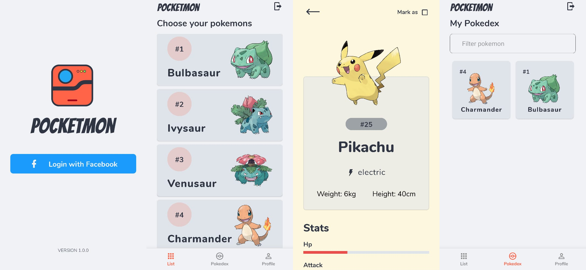

 

 
 
  

  
  

 
 
 

<h4 align="center">Project test to at NG Informaticas</h4>

  

### Getting started

- In your terminal, run the steps:

> `git clone https://github.com/evandersondev/pocketmon`

> `cd pokemon`

> You must change the file `.env.exmaple` to `.env` and add the APP_ID by <a href="https://developers.facebook.com/" target="_blank">Facebook for Developers</a>.

> `yarn` or `npm install` **for install the modules**.

> **run** `yarn start` or `npm start` or `expo start` .

> You can to use **Expo App** or the **Emulator** in your machine.

## Features

[//]: # 'Add the features of your project here:'

Features used in the Project.

- **<a href="https://docs.expo.io/" target="_blank">Expo</a>**
- **<a href="https://reactnavigation.org/" target="_blank">React Navigation</a>**
- **<a href="https://pokeapi.co/" target="_blank">PokéAPI</a>**
- **<a href="https://developers.facebook.com/" target="_blank">Facebook for Developers</a>**

### - LICENSE

This project is licensed under the MIT License - see the <a href="https://opensource.org/licenses/MIT" target="_blank">LICENSE</a> page for details.
